# **《醒狮跃境》系统设计分析书**

## 1. 系统架构设计

### 1.1 整体架构模式

基于Cocos2d-x引擎，采用**ECS架构**与**观察者模式**相结合的混合架构模式：

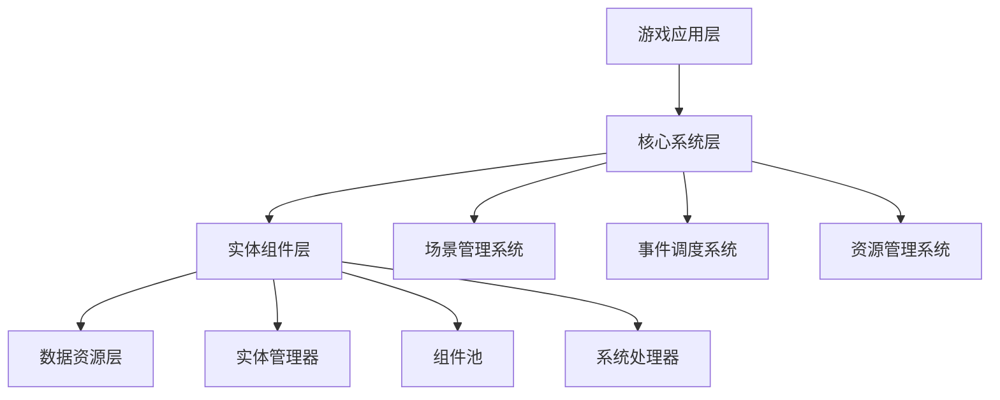

### 1.2 ECS架构设计

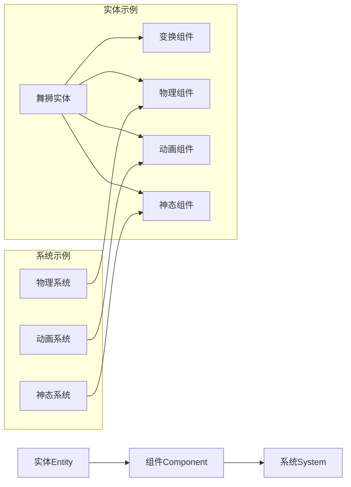

## 2. 核心系统模块设计

### 2.1 实体组件系统设计

#### 2.1.1 核心实体类型
- **舞狮实体**：包含双玩家控制的复合实体
- **机关实体**：可交互的关卡元素
- **平台实体**：地形和移动平台
- **UI实体**：界面显示元素

#### 2.1.2 关键组件设计

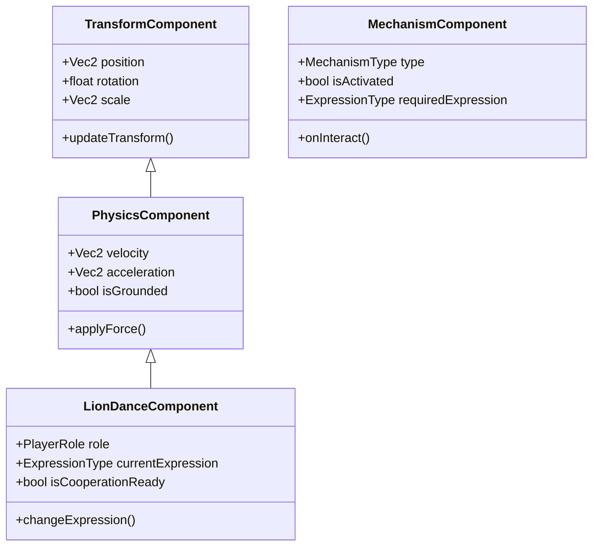

### 2.2 观察者模式事件系统

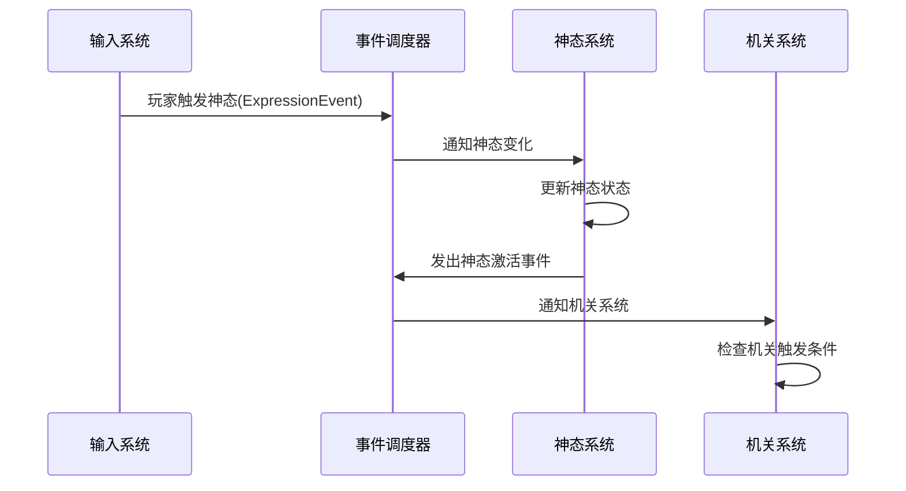

## 3. 系统模块详细设计

### 3.1 双人控制系统

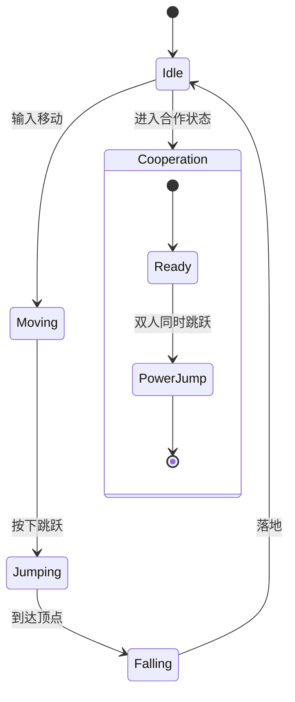

**关键设计要点**：
- 狮头玩家控制移动方向和基本跳跃
- 狮尾玩家控制抬尾动作和重量变化
- 合作动作通过状态同步实现

### 3.2 神态系统设计

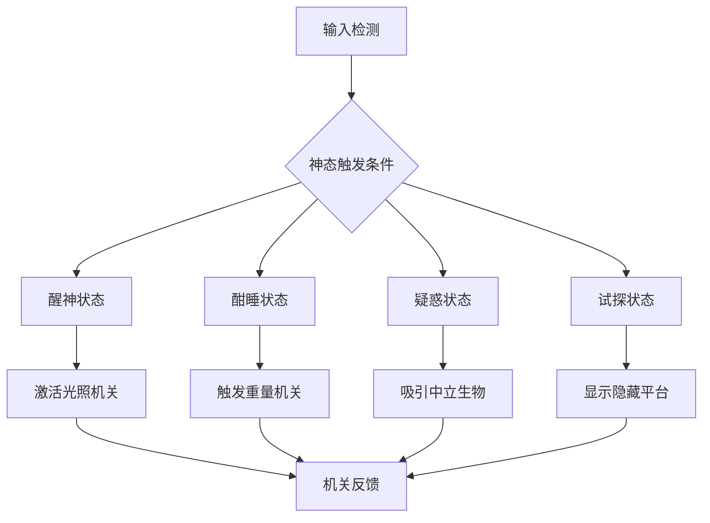

### 3.3 关卡与谜题系统

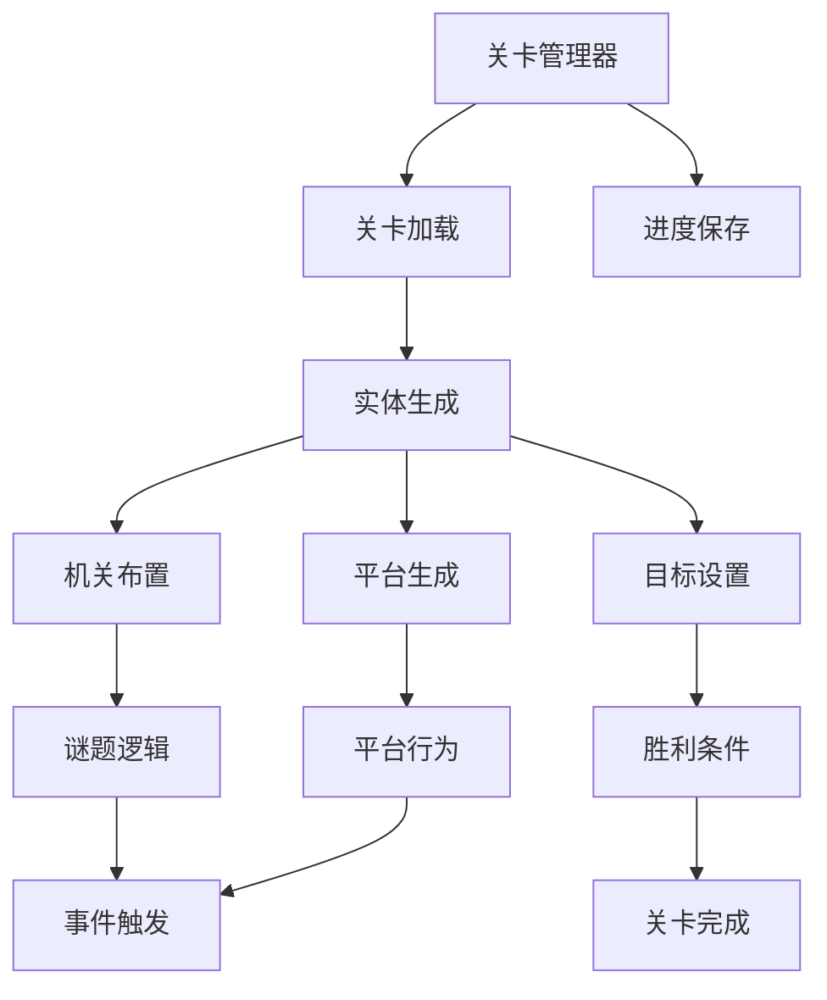

## 4. 数据流设计

### 4.1 游戏状态数据流

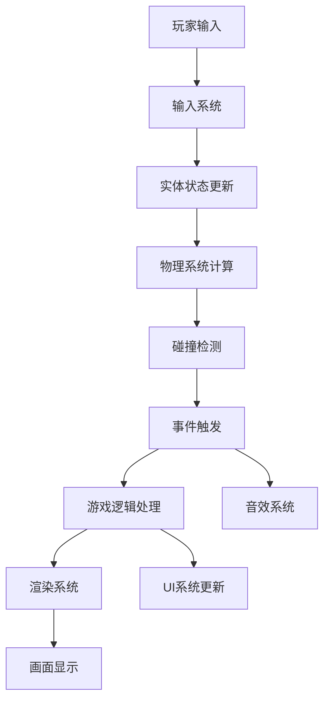

### 4.2 ECS数据更新流程

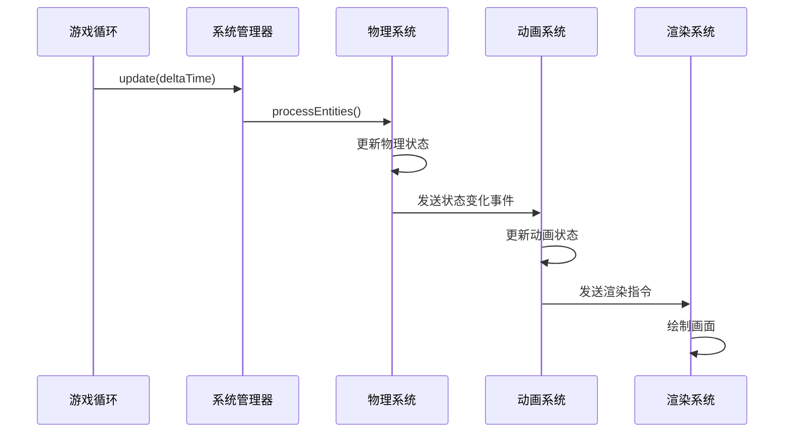

## 5. 场景与界面系统设计

### 5.1 场景管理状态机

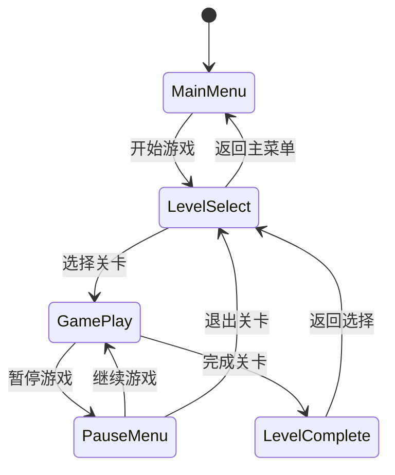

### 5.2 UI系统架构

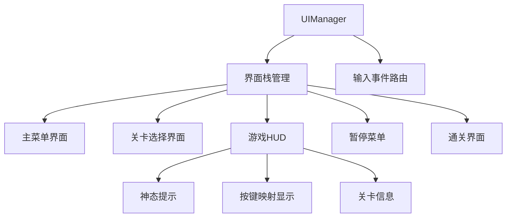

## 6. 资源管理系统设计

### 6.1 资源加载流程

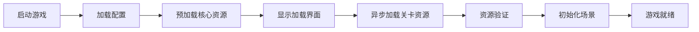

### 6.2 资源分类管理

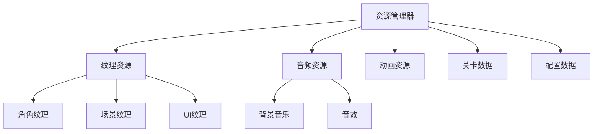

## 7. 性能优化设计

### 7.1 对象池设计

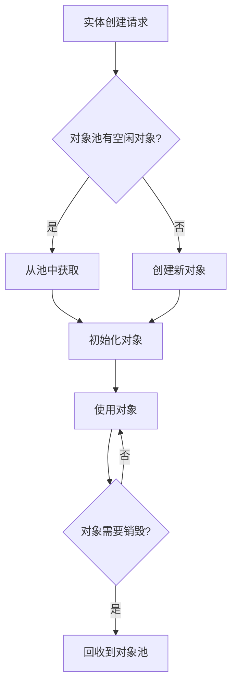

### 7.2 渲染优化策略

- **动态批处理**：相同材质的精灵自动批处理
- **视锥裁剪**：只渲染屏幕内可见对象
- **LOD系统**：根据距离调整渲染细节
- **纹理图集**：合并小纹理减少绘制调用

## 8. 扩展性设计

### 8.1 模块化扩展接口

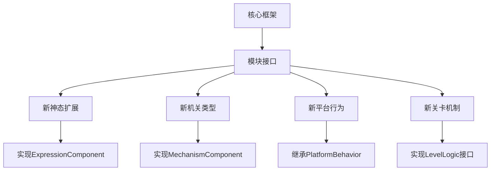

## 9. 关键技术决策

### 9.1 Cocos2d-x特定优化

- 使用Cocos2d-x的**节点树**管理场景层次
- 利用**Action系统**处理动画和移动
- **事件分发器**实现观察者模式
- **Schedule机制**替代传统游戏循环

### 9.2 ECS在Cocos2d-x中的实现策略

- 实体对应CCNode派生类
- 组件作为附加属性存在
- 系统通过Schedule定时更新
- 观察者模式连接各系统间通信

---

